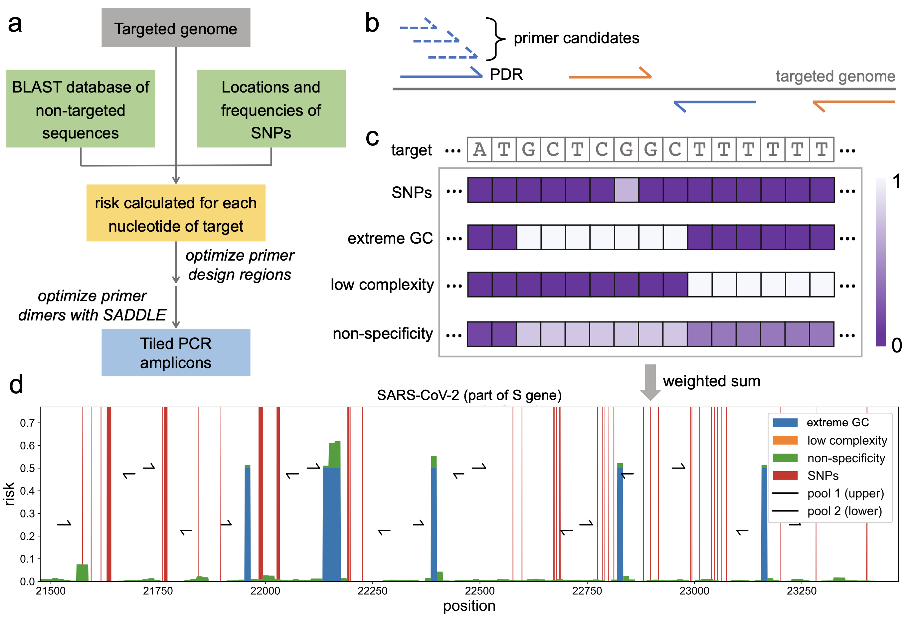

[](http://bioconda.github.io/recipes/olivar/README.html)
[](https://anaconda.org/bioconda/olivar)

# Olivar multiplex PCR tiling design

## Description
Olivar is a Python software for multiplex PCR tiling design. Olivar first builds an index for each target of interest, incorporating undesired sequence features such as homologous regions, SNPs and extreme GC content. Olivar then designs tiled amplicons covering a single index or multiple indexes, and minimizes primer dimers with the [SADDLE](https://doi.org/10.1038/s41467-022-29500-4) algorithm. Olivar is published as an [article](https://doi.org/10.1038/s41467-024-49957-9) on Nature Communications. 


## Web Interface

A web interface is available at [olivar.rice.edu](https://olivar.rice.edu/), although it does not support all available functions at the moment. 

## Install with Bioconda (Linux x64 or Mac Intel chip)

#### 1. Install Miniconda if not installed already ([quick command line install](https://docs.conda.io/projects/miniconda/en/latest/#quick-command-line-install))

#### 2. Create a new Conda environment named "olivar" and install Olivar via Bioconda
```
conda create -n olivar olivar --channel conda-forge --channel bioconda --channel defaults --strict-channel-priority
```
> [!TIP]
> Setting channel priority is important for Bioconda packages to function properly. You may also persist channel priority settings for all package installation by modifying your `~/.condarc` file. For more information, check the [Bioconda documentation](https://bioconda.github.io/). 

#### 3. Activate the new Conda environment and run Olivar
```
conda activate olivar
olivar --help
```

## Dependencies
```
python >=3.8
blast >=2.12.0
biopython
numpy <2
pandas
plotly >=5.13.0
tqdm
```

## Reproducibility

To reproduce the results in [example_output](example_output/) (primers used in the [publication](https://doi.org/10.1038/s41467-024-49957-9)), specify package versions during installation and run [example.py](example.py).
```
conda create -n olivar olivar=1.1.5 blast=2.13.0 numpy=1 --channel conda-forge --channel bioconda --strict-channel-priority
```
> [!CAUTION]
> [Git LFS](https://git-lfs.com/) is needed to clone the [example BLAST database](example_input/Human). Without Git LFS, `blastn` won't run on the incomplete example BLAST database and Olivar will raise `IndexError: list index out of range`. 


## Usage

### Input files
Olivar supports two input modes: 1) multiple sequence alignment (MSA), 2) reference sequence and an optional list of variations. 
Both modes could also take an optional BLAST database of non-specific sequences. [How to prepare a BLAST database?](#Prepare-a-BLAST-database).

#### Mode 1
 - (Required) An MSA for each target for tiling (or a group of unaligned sequences) in FASTA format ([example](example_input/H1N1-HA.fasta)). 
 - (Optional) A BLAST database of non-specific sequences. 

#### Mode 2
 - (Required) Reference sequence for each target for tiling, in FASTA format ([example](example_input/EPI_ISL_402124.fasta)). Ambiguous bases are not supported and may raise errors. 
 - (Optional) A list of sequence variations to be avoided for each reference, in CSV format ([example](example_input/delta_omicron_loc.csv)). Column "START" and "STOP" are required, "FREQ" is considered as 1.0 if empty. Other columns are not required. Coordinates are 1-based. 
 - (Optional) A BLAST database of non-specific sequences. 

> [!NOTE]
> Coordinates are always 1-based, closed intervals, except fot the output `.primer.bed` file, which is in [BED format](https://samtools.github.io/hts-specs/BEDv1.pdf). 

### Command-line interface

Olivar CLI comprises of five sub-commands: `build`, `tiling`, `save`, `specificity` and `sensitivity`. Descriptions of command-line arguments can be found in [Command-line parameters](#command-line-parameters). 
> [!TIP]
> Most sub-commands support multiprocessing with the `-p` option. 

#### 1. Build Olivar reference
Use one of the two input modes to build the reference

* **Mode 1:** A MSA (or a group of unaligned sequences) in FASTA format is required, BLAST database is optional. If the sequences are not aligned, add the `--align` option to make the MSA. 
    ```
    olivar build -m example_input/H1N1-HA.fasta -o example_output -p 1 -a 1
    ```

* **Mode 2:** A reference sequence in FASTA format is required, coordinates of sequence variations and BLAST database are optional. Only the first FASTA record is considered. 
    ```
    olivar build -f example_input/EPI_ISL_402124.fasta -v example_input/delta_omicron_loc.csv -d example_input/Human/GRCh38_primary -o example_output -p 1
    ```

An Olivar reference file ([EPI_ISL_402124.olvr](example_output/EPI_ISL_402124.olvr)) will be generated, named by the ID of the FASTA record by default. Use multiple CPU cores (`-p`) to accelerate this process. 

If you have multiple targets, run `olivar build` on each FASTA file and place all output `.olvr` files in the same directory. 

> In this step, the input reference sequence is chopped into kmers, and GC content, sequence complexity and BLAST hits are calculated for each kmer. Sequence variations are also labeled if coordinates are provided. A risk score is assigned to each nucleotide of the reference sequence, guiding the placement of primer design regions. 

#### 2. Design tiled amplicons
Input a single Olivar reference file generated in step 1, or a directory of multiple `.olvr` files (needs version ≥ 1.2). Set random seed (`--seed`) to make the results reproducible. Use multiple CPU cores (`-p`) to accelerate this process. Output files are listed below (coordinates are 1-based). 
```
olivar tiling example_output/EPI_ISL_402124.olvr -o example_output --max-amp-len 420 --min-amp-len 252 --check-var --seed 10 -p 1
```
| Default name &nbsp; &nbsp; &nbsp; &nbsp; &nbsp; &nbsp; &nbsp; &nbsp; &nbsp; &nbsp; | Description|
| :-------  | :-------- | 
| olivar-design.olvd| Olivar design file, keeping all intermediate results during the design. |
| olivar-design.csv| Sequences, coordinates (1-based) and pool assignment of primers, inserts and amplicons. |
| olivar-design.primer.bed| Primer sequences and coordinates in [ARTIC/PrimalScheme](https://github.com/artic-network/primer-schemes/tree/master/nCoV-2019) (BED) format. |
| olivar-design_SADDLE_Loss.html| Learning curve for primer dimer optimization. |
| olivar-design.json| Design configurations. |
| EPI_ISL_402124_ref.fasta| Reference sequence. |
| EPI_ISL_402124.html| An interactive plot to view primers and the risk array. |
| EPI_ISL_402124_PDR_Loss.html| Learning curve for PDR optimization. |
| EPI_ISL_402124_risk.csv| Risk scores of each risk component. |

"olivar-design" is the name of the whole design (might contain multiple targets), and "EPI_ISL_402124" is the name of a single target, determined by the ID of the reference FASTA record by default (see [step 1](#1-build-olivar-reference)). 

> In this step, the placement of primer design regions (PDRs) is optimized based on the risk array ([Fig.1d](Figures/Fig1.png)), and primer candidates are generated by SADDLE for each PDR in the optimized PDR set. SADDLE also minimizes primer dimer by exploring different combinations of primer candidates. 

#### (Optional) Load from a previous Olivar design and save output files
Output files in step 2 can be generated repeatedly as long as the Olivar deisng file (.olvd) is provided. 
```
olivar save example_output/olivar-design.olvd -o example_output
```
> [!WARNING]
> .olvr and .olvd files are generated with [pickle](https://docs.python.org/3/library/pickle.html). Do NOT load those files from untrusted sources.

#### (Optional) Check the specificity of existing primer pools against a BLAST database of non-spefic sequences
 - Input should be a CSV file, with four required columns: "amplicon_id" (amplicon name), "fP" (sequence of forward primer), "rP" (sequence of reverse primer) and "pool" (primer pool number, e.g., 1). This could be an Olivar designed primer pool generated in step 2, or primer pools that are not designed by Olivar. 
 - If a BLAST database is not provided, only basic information of each primer is output.
 - Use multiple CPU cores (`-p`) to accelerate this process. 
 - Output files are listed below (coordinates are 1-based). 
```
olivar specificity example_output/olivar-design.csv --pool 1 -d example_input/Human/GRCh38_primary -o example_output -p 1
```
| Default name &nbsp; &nbsp; &nbsp; &nbsp; &nbsp; &nbsp; &nbsp; &nbsp; &nbsp; &nbsp; | Description|
| :-------  | :-------- | 
| olivar-specificity_pool-1.csv| Basic information of each single primer, including dG, dimer score, BLAST hits, etc. |
| olivar-specificity_pool-1_ns-amp.csv| Predicted non-specific amplicons. |
| olivar-specificity_pool-1_ns-pair.csv| Predicted non-specific primer pairs. |

#### (Optional) Check sensitivity of existing primer pools against an MSA of target sequences
 - Input should be a CSV file, with four required columns: "amplicon_id" (amplicon name), "fP" (sequence of forward primer), "rP" (sequence of reverse primer) and "pool" (primer pool number, e.g., 1). This could be an Olivar designed primer pool generated in step 2, or primer pools that are not designed by Olivar. 
 - An MSA of target sequences is required. 
 - Use multiple CPU cores (`-p`) to accelerate this process. 
 - Output files are listed below (coordinates are 1-based). 
```
olivar sensitivity example_output/olivar-design.csv -m example_input/H1N1-HA.fasta --pool 1 -o example_output -p 1
```
| Default name &nbsp; &nbsp; &nbsp; &nbsp; &nbsp; &nbsp; &nbsp; &nbsp; &nbsp; &nbsp; | Description|
| :-------  | :-------- | 
| olivar-sensitivity_pool-1.out| A report of each single primer, including GC content, dG, primer alignment, and sensitivity score. |
| olivar-sensitivity_pool-1.html| An interactive plot to view primers and the MSA. |


### Import Olivar as a Python package

Olivar can also be imported as a Python package, comprising of four functions with the same names and parameters as the four sub-commands in the CLI. 
```
from olivar import build, tiling, save, specificity, sensitivity
```
Refer to [example.py](example.py) for more details.


## Command-line parameters
#### sub-command: `build`
```
olivar build [--fasta <string>] [--var <string>] [--msa <string>] [--db <string>] 
[--output <string>] [--title <string>] [--threads <int>] [--align]
```
| Argument &nbsp; &nbsp; &nbsp; &nbsp; &nbsp; &nbsp; &nbsp; &nbsp; &nbsp; &nbsp; | Default &nbsp; &nbsp; &nbsp; &nbsp; &nbsp; &nbsp; &nbsp; | Description|
| :-------  | :----- | :-------- | 
|--fasta, -f| **None**| Positional argument. Path to the FASTA reference sequence.|
|--var, -v| **None**| Optional, path to the csv file of SNP coordinates and frequencies. Required columns: "START", "STOP", "FREQ". "FREQ" is considered as 1.0 if empty. Coordinates are 1-based.|
|--msa, -m| **None**| Path to the MSA (or a group of unaligned sequences) in FASTA format.|
|--db, -d| **None**| Optional, path to the BLAST database. Note that this path should end with the name of the BLAST database (e.g., "example_input/Human/GRCh38_primary").|
|--output, -o| ./| Output directory (output to current directory by default).|
|--title, -t| FASTA record ID| Name of the Olivar reference file.|
|--threads, -p| 1| Number of threads.|
|--align, -a| N/A| Boolean flag. Make an MSA with [mafft](https://mafft.cbrc.jp/alignment/software/) if the sequences provided to `--msa` are not aligned.|

#### sub-command: `tiling`
```
olivar tiling olvr-path [--output <string>] [--title <string>] [--max-amp-len <int>] 
[--min-amp-len <int>] [--w-egc <float>] [--w-lc <float>] [--w-ns <float>] [--w-var <float>] 
[--temperature <float>] [--salinity <float>] [--dg-max <float>] [--min-gc <float>] 
[--max-gc <float>] [--min-complexity <float>] [--max-len <int>] [--check-var] 
[--fp-prefix <DNA>] [--rp-prefix <DNA>] [--seed <int>] [--threads <int>]
```
| Argument &nbsp; &nbsp; &nbsp; &nbsp; &nbsp; &nbsp; &nbsp; &nbsp; &nbsp; &nbsp; &nbsp; &nbsp; &nbsp; &nbsp; &nbsp; | Default &nbsp; &nbsp; &nbsp; &nbsp; &nbsp; &nbsp; &nbsp; | Description|
| :-------  | :----- | :-------- | 
| olvr-path| | Positional argument. Path to the Olivar reference file (.olvr), or the directory of reference files for multiple targets|
|--output, -o| ./| Output path (output to current directory by default).|
|--title, -t| olivar-design| Name of design.|
|--max-amp-len| 420| Maximum amplicon length.|
|--min-amp-len| None| Minimum amplicon length. 0.9*{max-amp-len} if not provided.|
|--w-egc| 1.0| Weight for extreme GC content.|
|--w-lc| 1.0| Weight for low sequence complexity.|
|--w-ns| 1.0| Weight for non-specificity.|
|--w-var| 1.0| Weight for variations.|
|--temperature| 60.0| PCR annealing temperature.|
|--salinity| 0.18| Concentration of monovalent ions in units of molar.|
|--dg-max| -11.8| Maximum free energy change of a primer in kcal/mol.|
|--min-gc| 0.2| Minimum GC content of a primer.|
|--max-gc| 0.75| Maximum GC content of a primer.|
|--min-complexity| 0.4| Minimum sequence complexity of a primer.|
|--max-len| 36| Maximum length of a primer.|
|--check-var| N/A| Boolean flag. Filter out primer candidates with variations within 5nt of 3' end. NOT recommended when a lot of variations are provided, since this would significantly reduce the number of primer candidates. |
|--fp-prefix| **None**| Prefix of forward primer. Empty by default.|
|--rp-prefix| **None**| Prefix of reverse primer. Empty by default.|
|--seed| 10| Random seed for optimizing PDRs and SADDLE.|
|--threads, -p| 1| Number of threads.|

#### sub-command: `save`
```
olivar save olvd-file [--output <string>]
```
| Argument &nbsp; &nbsp; &nbsp; &nbsp; &nbsp; | Default| Description|
| :-------  | :----- | :-------- | 
| olvd-file| | Positional argument. Path to the Olivar design file (.olvd)|
|--output, -o| ./| Output directory (output to current directory by default).|

#### sub-command: `specificity`
```
olivar specificity csv-file [--pool <int>] [--db <string>] [--output <string>] 
[--title <string>] [--max-amp-len <int>] [--temperature <float>] [--threads <int>]
```
| Argument &nbsp; &nbsp; &nbsp; &nbsp; &nbsp; &nbsp; &nbsp; &nbsp; &nbsp; &nbsp; &nbsp; &nbsp; &nbsp; &nbsp; &nbsp; | Default &nbsp; &nbsp; &nbsp; &nbsp; &nbsp; &nbsp; &nbsp; | Description|
| :-------  | :----- | :-------- | 
| csv-file| | Positional argument. Path to the csv file of a primer pool. Required columns: "amplicon_id" (amplicon name), "fP" (sequence of forward primer), "rP" (sequence of reverse primer), "pool" (pool number, e.g., 1).|
|--pool| 1| Primer pool number. |
|--db, -d| **None**| Optional, path to the BLAST database. Note that this path should end with the name of the BLAST database (e.g., "example_input/Human/GRCh38_primary").|
|--output, -o| ./| Output directory (output to current directory by default).|
|--title, -t| olivar-val| Name of validation.|
|--max-amp-len| 1500| Maximum length of predicted non-specific amplicon. Ignored is no BLAST database is provided.|
|--temperature| 60.0| PCR annealing temperature.|
|--threads, -p| 1| Number of threads.|

#### sub-command: `sensitivity`
```
olivar sensitivity csv-file [--pool <int>] [--msa <string>] [--temperature <float>] 
[--sodium <float>] [--output <string>] [--title <string>] [--threads <int>]
```
| Argument &nbsp; &nbsp; &nbsp; &nbsp; &nbsp; &nbsp; &nbsp; &nbsp; &nbsp; &nbsp; &nbsp; &nbsp; &nbsp; &nbsp; &nbsp; | Default &nbsp; &nbsp; &nbsp; &nbsp; &nbsp; &nbsp; &nbsp; | Description|
| :-------  | :----- | :-------- | 
| csv-file| | Positional argument. Path to the csv file of a primer pool. Required columns: "amplicon_id" (amplicon name), "fP" (sequence of forward primer), "rP" (sequence of reverse primer), "pool" (pool number, e.g., 1).|
|--pool| 1| Primer pool number.|
|--msa, -m| **None**| Path to the MSA in FASTA format.|
|--temperature| 60.0| PCR annealing temperature.|
|--sodium, -s| 0.18| The sum of the concentrations of monovalent ions (Na+, K+, NH4+), in molar [0.18].|
|--output, -o| ./| Output directory (output to current directory by default).|
|--title, -t| olivar-sensitivity| Name of validation.|
|--threads, -p| 1| Number of threads.|


## Prepare a BLAST database
> [!TIP]
> All BLAST related commands/scripts are installed along with Olivar. 
 - To make your own BLAST database with the `makeblastdb` command, check out the [NCBI BLAST User Manual](https://www.ncbi.nlm.nih.gov/books/NBK569841/). \
The [example BLAST database](example_input/Human) is created with 23 Chromosomes and MT of human genome assembly [GRCh38](https://www.ncbi.nlm.nih.gov/datasets/genome/GCF_000001405.40/), with the command (BLAST version 2.12.0):
```
makeblastdb -in GRCh38_primary.fasta -dbtype nucl -title GRCh38_primary -parse_seqids -hash_index -out GRCh38_primary -max_file_sz 4GB -logfile makeblastdb.out -taxid 9606
```
 - To download a pre-built BLAST database from NCBI (e.g., RefSeq representative gennomes for viruses), use the `update_blastdb.pl` script:
```
update_blastdb.pl --decompress ref_viruses_rep_genomes
```
For more details about `update_blastdb.pl`, check the [BLAST Help](https://www.ncbi.nlm.nih.gov/books/NBK52640/#_chapter1_Database_Download_). \
For more pre-built databases, check the [NCBI FTP site](https://ftp.ncbi.nlm.nih.gov/blast/db/).
